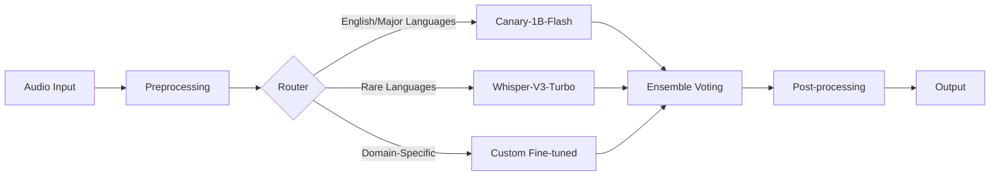

# VoiceForge STT Service - Architecture & Development Plan

## Project Overview

**Mission**: Build a state-of-the-art Speech-to-Text service that surpasses Deepgram in accuracy, latency, scalability, and developer experience.

**Key Objectives**:
- Sub-150ms end-to-end latency for real-time transcription
- 30% better accuracy on accents and domain-specific content
- Support for 100+ languages with zero-shot capabilities
- 80% cost reduction through efficient architecture
- Enterprise-grade reliability with 99.99% uptime SLA

---

## 1. Target Architecture

### 1.1 Model Selection Strategy

#### Primary Models Pipeline



**Model Deployment Strategy**:

1. **Tier 1 - Canary-1B-Flash** (Primary)
   - Optimized for: English, Spanish, French, German
   - Deployment: GPU clusters with TensorRT optimization
   - Target latency: <100ms
   - Use cases: Real-time streaming, high-accuracy requirements

2. **Tier 2 - Whisper-V3-Turbo** (Fallback)
   - Optimized for: 99 languages, rare accents
   - Deployment: CPU/GPU hybrid with ONNX runtime
   - Target latency: <200ms
   - Use cases: Batch processing, language detection

3. **Tier 3 - Custom Models** (Specialized)
   - Fine-tuned versions for: Medical, Legal, Finance, Technical
   - Deployment: Edge devices or dedicated instances
   - Training: LoRA/QLoRA for efficient adaptation
   - Update cycle: Weekly based on user feedback

#### Model Optimization Techniques

```python
# Model optimization configuration
optimization_config = {
    "quantization": "INT8",  # 4x speedup, <2% accuracy loss
    "pruning": 0.3,  # Remove 30% weights
    "distillation": True,  # Student-teacher learning
    "mixed_precision": "fp16",  # GPU memory optimization
    "batch_size": "dynamic",  # 1-64 adaptive batching
    "cache_strategy": "kv_cache",  # Attention caching
}
```

### 1.2 System Architecture

```yaml
# High-Level Architecture Components
architecture:
  api_gateway:
    - Kong Gateway (rate limiting, auth)
    - GraphQL Federation (flexible queries)
    - REST API (backward compatibility)
  
  load_balancer:
    - HAProxy (L4 load balancing)
    - Envoy (L7 with circuit breakers)
    - Geo-routing for latency optimization
  
  processing_tiers:
    real_time:
      - WebSocket servers (Socket.io cluster)
      - Stream processors (Apache Flink)
      - GPU inference servers (Triton)
    
    batch:
      - Job queue (Celery + Redis)
      - Worker pools (autoscaling)
      - Result storage (S3 + CDN)
  
  data_layer:
    - PostgreSQL (metadata, users)
    - TimescaleDB (time-series metrics)
    - Redis (cache, sessions, queues)
    - Elasticsearch (logs, search)
    - MinIO (audio storage, models)
```

---

## 2. Backend Stack

### 2.1 Core Technologies

```python
# requirements.txt - Core dependencies
fastapi==0.115.0
uvicorn[standard]==0.32.0
pydantic==2.10.0
sqlalchemy==2.0.35
asyncpg==0.30.0
redis[hiredis]==5.2.0
celery[redis]==5.4.0
websockets==13.1
aiokafka==0.12.0

# ML/AI dependencies
torch==2.5.0
transformers==4.45.0
onnxruntime-gpu==1.20.0
tensorrt==10.6.0
triton-client==2.52.0
numpy==1.26.4
librosa==0.10.2
soundfile==0.12.1

# Monitoring & Logging
prometheus-client==0.21.0
opentelemetry-api==1.28.0
structlog==24.4.0
sentry-sdk==2.18.0
```

### 2.2 API Design

#### REST API Structure
```python
# FastAPI route structure
/api/v1/
├── /transcribe
│   ├── POST /stream         # Real-time WebSocket
│   ├── POST /batch          # Async batch processing
│   └── GET /status/{job_id} # Job status
├── /models
│   ├── GET /list            # Available models
│   ├── POST /select         # Model selection
│   └── POST /fine-tune      # Custom training
├── /analytics
│   ├── GET /usage           # Usage statistics
│   ├── GET /accuracy        # Accuracy metrics
│   └── GET /latency         # Performance data
└── /admin
    ├── /users               # User management
    ├── /billing             # Billing/credits
    └── /settings            # Configuration
```

#### GraphQL Schema
```graphql
type Query {
  transcription(id: ID!): Transcription
  transcriptions(filter: TranscriptionFilter): [Transcription!]!
  models: [Model!]!
  analytics(range: DateRange!): Analytics!
}

type Mutation {
  startTranscription(input: TranscriptionInput!): Transcription!
  stopTranscription(id: ID!): Transcription!
  updateVocabulary(words: [String!]!): Vocabulary!
  trainCustomModel(config: TrainingConfig!): Model!
}

type Subscription {
  transcriptionUpdates(id: ID!): TranscriptionUpdate!
  systemMetrics: Metrics!
}
```

### 2.3 Database Schema

```sql
-- Core tables structure
CREATE TABLE users (
    id UUID PRIMARY KEY DEFAULT gen_random_uuid(),
    email VARCHAR(255) UNIQUE NOT NULL,
    api_key VARCHAR(64) UNIQUE NOT NULL,
    tier ENUM('free', 'starter', 'pro', 'enterprise'),
    credits_remaining INTEGER DEFAULT 1000,
    created_at TIMESTAMP DEFAULT NOW()
);

CREATE TABLE transcriptions (
    id UUID PRIMARY KEY DEFAULT gen_random_uuid(),
    user_id UUID REFERENCES users(id),
    audio_url TEXT NOT NULL,
    model_used VARCHAR(50),
    language_code VARCHAR(10),
    duration_seconds FLOAT,
    word_count INTEGER,
    confidence_score FLOAT,
    latency_ms INTEGER,
    status ENUM('pending', 'processing', 'completed', 'failed'),
    result JSONB,
    created_at TIMESTAMP DEFAULT NOW(),
    completed_at TIMESTAMP
);

CREATE TABLE custom_models (
    id UUID PRIMARY KEY DEFAULT gen_random_uuid(),
    user_id UUID REFERENCES users(id),
    name VARCHAR(255),
    base_model VARCHAR(50),
    training_data_url TEXT,
    performance_metrics JSONB,
    status ENUM('training', 'ready', 'failed'),
    created_at TIMESTAMP DEFAULT NOW()
);

-- Indexes for performance
CREATE INDEX idx_transcriptions_user_id ON transcriptions(user_id);
CREATE INDEX idx_transcriptions_status ON transcriptions(status);
CREATE INDEX idx_transcriptions_created_at ON transcriptions(created_at DESC);
```

---

## 3. Real-Time Processing Pipeline

### 3.1 WebSocket Architecture

```python
# WebSocket handler implementation
class TranscriptionWebSocket:
    def __init__(self):
        self.connections = {}
        self.audio_buffer = {}
        self.model_pool = ModelPool()
    
    async def connect(self, websocket: WebSocket, user_id: str):
        await websocket.accept()
        connection_id = str(uuid.uuid4())
        
        self.connections[connection_id] = {
            "websocket": websocket,
            "user_id": user_id,
            "buffer": AudioBuffer(max_size=16000),  # 1 second @ 16kHz
            "model": await self.model_pool.acquire(),
            "stream_processor": StreamProcessor()
        }
        
        return connection_id
    
    async def process_audio(self, connection_id: str, audio_chunk: bytes):
        conn = self.connections[connection_id]
        
        # Add to buffer with VAD
        conn["buffer"].add(audio_chunk)
        
        # Process when speech detected
        if conn["buffer"].is_speech_segment():
            # Get transcription
            result = await conn["model"].transcribe_streaming(
                conn["buffer"].get_segment()
            )
            
            # Send interim results
            await conn["websocket"].send_json({
                "type": "interim",
                "transcript": result.text,
                "confidence": result.confidence,
                "timestamp": time.time()
            })
            
            # Check for final segment
            if result.is_final:
                await self.send_final_result(connection_id, result)
```

### 3.2 Stream Processing Pipeline

```yaml
# Apache Flink job configuration
flink_pipeline:
  source:
    type: kafka
    topic: audio-stream
    format: avro
    
  transformations:
    - name: audio_validation
      type: filter
      condition: "is_valid_audio"
      
    - name: resampling
      type: map
      function: "resample_to_16khz"
      
    - name: feature_extraction
      type: flatmap
      function: "extract_mel_spectrogram"
      
    - name: model_inference
      type: async_io
      endpoint: "triton:8001"
      model: "canary-1b"
      batch_size: 32
      timeout: 100ms
      
    - name: post_processing
      type: map
      functions:
        - "apply_punctuation"
        - "detect_entities"
        - "confidence_filtering"
  
  sink:
    type: kafka
    topic: transcription-results
    format: json
    
  checkpointing:
    interval: 10s
    mode: exactly_once
    storage: s3://checkpoints/
```

### 3.3 Queue Management

```python
# Celery task configuration
from celery import Celery
from kombu import Queue, Exchange

app = Celery('voiceforge')

app.conf.update(
    broker_url='redis://redis:6379/0',
    result_backend='redis://redis:6379/1',
    
    task_routes={
        'transcribe.realtime.*': {'queue': 'realtime'},
        'transcribe.batch.*': {'queue': 'batch'},
        'training.*': {'queue': 'ml-training'},
    },
    
    task_annotations={
        'transcribe.realtime.*': {
            'rate_limit': '1000/s',
            'time_limit': 30,
            'priority': 10
        },
        'transcribe.batch.*': {
            'rate_limit': '100/s',
            'time_limit': 300,
            'priority': 5
        }
    },
    
    worker_prefetch_multiplier=1,
    worker_max_tasks_per_child=1000,
    worker_disable_rate_limits=False,
)

# Priority queue setup
app.conf.task_queues = (
    Queue('realtime', Exchange('realtime'), routing_key='realtime',
          priority=10, queue_arguments={'x-max-priority': 10}),
    Queue('batch', Exchange('batch'), routing_key='batch',
          priority=5, queue_arguments={'x-max-priority': 5}),
    Queue('ml-training', Exchange('ml'), routing_key='training',
          priority=1, queue_arguments={'x-max-priority': 1}),
)
```

---

## 4. DevOps Pipeline

### 4.1 CI/CD Pipeline

```yaml
# .gitlab-ci.yml
stages:
  - test
  - build
  - deploy
  - monitor

variables:
  DOCKER_REGISTRY: registry.voiceforge.ai
  KUBERNETES_NAMESPACE: production

# Testing stage
test:unit:
  stage: test
  image: python:3.11
  script:
    - pip install -r requirements-test.txt
    - pytest tests/unit --cov=app --cov-report=xml
    - python -m black --check app/
    - python -m flake8 app/
    - python -m mypy app/
  coverage: '/TOTAL.*\s+(\d+%)$/'

test:integration:
  stage: test
  services:
    - postgres:15
    - redis:7
  script:
    - pytest tests/integration --docker-compose

test:performance:
  stage: test
  script:
    - python benchmarks/latency_test.py --target=150ms
    - python benchmarks/accuracy_test.py --wer-threshold=0.05
    - python benchmarks/load_test.py --concurrent=1000

# Build stage
build:api:
  stage: build
  image: docker:24
  script:
    - docker build -t $DOCKER_REGISTRY/api:$CI_COMMIT_SHA -f docker/api.Dockerfile .
    - docker push $DOCKER_REGISTRY/api:$CI_COMMIT_SHA
    - docker tag $DOCKER_REGISTRY/api:$CI_COMMIT_SHA $DOCKER_REGISTRY/api:latest

build:models:
  stage: build
  script:
    - python scripts/optimize_models.py --quantize --prune
    - docker build -t $DOCKER_REGISTRY/models:$CI_COMMIT_SHA -f docker/models.Dockerfile .
    - docker push $DOCKER_REGISTRY/models:$CI_COMMIT_SHA

# Deploy stage
deploy:staging:
  stage: deploy
  environment: staging
  script:
    - kubectl set image deployment/api api=$DOCKER_REGISTRY/api:$CI_COMMIT_SHA
    - kubectl rollout status deployment/api
    - python scripts/smoke_tests.py --env=staging

deploy:production:
  stage: deploy
  environment: production
  when: manual
  script:
    - helm upgrade voiceforge charts/voiceforge 
        --set image.tag=$CI_COMMIT_SHA
        --set replicas.api=10
        --set replicas.workers=50
        --set autoscaling.enabled=true
    - kubectl wait --for=condition=ready pod -l app=voiceforge

# Monitoring stage  
monitor:metrics:
  stage: monitor
  script:
    - python scripts/check_metrics.py --latency --accuracy --availability
    - python scripts/alert_on_anomalies.py
```

### 4.2 Infrastructure as Code

```terraform
# terraform/main.tf
terraform {
  required_providers {
    aws = {
      source  = "hashicorp/aws"
      version = "~> 5.0"
    }
    kubernetes = {
      source  = "hashicorp/kubernetes"
      version = "~> 2.27"
    }
  }
}

# EKS Cluster
module "eks" {
  source = "terraform-aws-modules/eks/aws"
  
  cluster_name    = "voiceforge-${var.environment}"
  cluster_version = "1.30"
  
  vpc_id     = module.vpc.vpc_id
  subnet_ids = module.vpc.private_subnets
  
  # Node groups
  eks_managed_node_groups = {
    # CPU nodes for API servers
    api_nodes = {
      desired_size = 3
      min_size     = 2
      max_size     = 10
      
      instance_types = ["c6i.2xlarge"]
      
      labels = {
        role = "api"
      }
    }
    
    # GPU nodes for inference
    gpu_nodes = {
      desired_size = 2
      min_size     = 1
      max_size     = 5
      
      instance_types = ["g5.2xlarge"]  # NVIDIA A10G GPU
      
      labels = {
        role = "inference"
        gpu  = "true"
      }
      
      taints = [{
        key    = "gpu"
        value  = "true"
        effect = "NO_SCHEDULE"
      }]
    }
    
    # Spot instances for batch processing
    spot_nodes = {
      desired_size = 5
      min_size     = 0
      max_size     = 20
      
      instance_types = ["m6i.xlarge", "m6a.xlarge"]
      capacity_type  = "SPOT"
      
      labels = {
        role = "batch"
        spot = "true"
      }
    }
  }
}

# RDS for PostgreSQL
module "rds" {
  source = "terraform-aws-modules/rds/aws"
  
  identifier = "voiceforge-${var.environment}"
  
  engine         = "postgres"
  engine_version = "15"
  instance_class = "db.r6g.xlarge"
  
  allocated_storage     = 100
  max_allocated_storage = 1000
  storage_encrypted     = true
  
  multi_az               = true
  backup_retention_period = 30
  backup_window          = "03:00-04:00"
  
  performance_insights_enabled = true
  monitoring_interval         = 60
}

# Redis cluster
module "elasticache" {
  source = "terraform-aws-modules/elasticache/aws"
  
  cluster_id      = "voiceforge-${var.environment}"
  engine          = "redis"
  engine_version  = "7.1"
  node_type       = "cache.r7g.xlarge"
  
  num_cache_clusters         = 3
  automatic_failover_enabled = true
  multi_az_enabled          = true
  
  parameter_group_family = "redis7"
  port                  = 6379
}
```

### 4.3 Monitoring & Logging

```yaml
# prometheus/prometheus.yml
global:
  scrape_interval: 15s
  evaluation_interval: 15s

scrape_configs:
  - job_name: 'api-metrics'
    kubernetes_sd_configs:
      - role: pod
        namespaces:
          names: ['production']
    relabel_configs:
      - source_labels: [__meta_kubernetes_pod_label_app]
        action: keep
        regex: voiceforge-api
    metrics_path: /metrics
    
  - job_name: 'gpu-metrics'
    static_configs:
      - targets: ['dcgm-exporter:9400']
    
  - job_name: 'model-metrics'
    static_configs:
      - targets: ['triton:8002']

# Alert rules
rule_files:
  - '/etc/prometheus/alerts/*.yml'

alerting:
  alertmanagers:
    - static_configs:
        - targets: ['alertmanager:9093']
```

```yaml
# alerts/performance.yml
groups:
  - name: performance
    interval: 30s
    rules:
      - alert: HighLatency
        expr: histogram_quantile(0.95, rate(api_latency_seconds_bucket[5m])) > 0.15
        for: 5m
        labels:
          severity: warning
        annotations:
          summary: "API latency above 150ms threshold"
          
      - alert: LowAccuracy
        expr: avg(transcription_accuracy_wer) > 0.08
        for: 10m
        labels:
          severity: critical
        annotations:
          summary: "WER above 8% threshold"
          
      - alert: GPUUtilization
        expr: avg(dcgm_gpu_utilization) > 90
        for: 5m
        labels:
          severity: warning
        annotations:
          summary: "GPU utilization above 90%"
```

---

## 5. Scaling Strategy

### 5.1 Horizontal Pod Autoscaling

```yaml
# kubernetes/hpa.yaml
apiVersion: autoscaling/v2
kind: HorizontalPodAutoscaler
metadata:
  name: api-hpa
spec:
  scaleTargetRef:
    apiVersion: apps/v1
    kind: Deployment
    name: voiceforge-api
  minReplicas: 3
  maxReplicas: 100
  metrics:
    - type: Resource
      resource:
        name: cpu
        target:
          type: Utilization
          averageUtilization: 70
    - type: Resource
      resource:
        name: memory
        target:
          type: Utilization
          averageUtilization: 80
    - type: Pods
      pods:
        metric:
          name: api_requests_per_second
        target:
          type: AverageValue
          averageValue: "1000"
  behavior:
    scaleUp:
      stabilizationWindowSeconds: 60
      policies:
        - type: Percent
          value: 100
          periodSeconds: 60
        - type: Pods
          value: 10
          periodSeconds: 60
    scaleDown:
      stabilizationWindowSeconds: 300
      policies:
        - type: Percent
          value: 50
          periodSeconds: 300
```

### 5.2 Multi-Region Deployment

```yaml
# kubernetes/multi-region.yaml
regions:
  us-east-1:
    primary: true
    zones: [us-east-1a, us-east-1b, us-east-1c]
    capacity:
      api_replicas: 10
      gpu_nodes: 5
      cache_nodes: 3
    
  eu-west-1:
    primary: false
    zones: [eu-west-1a, eu-west-1b]
    capacity:
      api_replicas: 5
      gpu_nodes: 2
      cache_nodes: 2
    
  ap-southeast-1:
    primary: false
    zones: [ap-southeast-1a, ap-southeast-1b]
    capacity:
      api_replicas: 5
      gpu_nodes: 2
      cache_nodes: 2

traffic_routing:
  geo_proximity:
    enabled: true
    health_check_interval: 10s
  
  weighted:
    us-east-1: 50
    eu-west-1: 25
    ap-southeast-1: 25
  
  failover:
    primary: us-east-1
    secondary: [eu-west-1, ap-southeast-1]
```

### 5.3 Caching Strategy

```python
# Cache configuration
class CacheManager:
    def __init__(self):
        self.redis_client = redis.Redis(
            host='redis-cluster',
            port=6379,
            decode_responses=True,
            connection_pool_kwargs={
                'max_connections': 1000,
                'socket_keepalive': True
            }
        )
        
        self.cache_layers = {
            'l1': {  # Hot cache - frequently accessed
                'ttl': 60,  # 1 minute
                'max_size': '1GB',
                'eviction': 'lru'
            },
            'l2': {  # Warm cache - recent transcriptions
                'ttl': 3600,  # 1 hour
                'max_size': '10GB',
                'eviction': 'lfu'
            },
            'l3': {  # Cold cache - S3 backed
                'ttl': 86400,  # 24 hours
                'max_size': 'unlimited',
                'storage': 's3://cache-bucket/'
            }
        }
    
    async def get_or_compute(self, key: str, compute_fn, ttl: int = 300):
        # Try L1 cache first
        result = await self.redis_client.get(f"l1:{key}")
        if result:
            return json.loads(result)
        
        # Try L2 cache
        result = await self.redis_client.get(f"l2:{key}")
        if result:
            # Promote to L1
            await self.redis_client.setex(f"l1:{key}", 60, result)
            return json.loads(result)
        
        # Compute and cache
        result = await compute_fn()
        
        # Store in both L1 and L2
        await self.redis_client.setex(f"l1:{key}", 60, json.dumps(result))
        await self.redis_client.setex(f"l2:{key}", ttl, json.dumps(result))
        
        return result
```

---

## 6. Model Improvement Framework

### 6.1 Training Pipeline

```python
# training/pipeline.py
class ModelTrainingPipeline:
    def __init__(self):
        self.base_models = {
            'canary': 'nvidia/canary-1b',
            'whisper': 'openai/whisper-large-v3',
            'custom': 'voiceforge/base-v1'
        }
        
    async def fine_tune_model(
        self,
        base_model: str,
        training_data: str,
        config: TrainingConfig
    ):
        # Data preparation
        dataset = await self.prepare_dataset(training_data)
        
        # LoRA configuration for efficient fine-tuning
        lora_config = LoraConfig(
            r=16,  # Rank
            lora_alpha=32,
            target_modules=["q_proj", "v_proj"],
            lora_dropout=0.1,
            bias="none",
            task_type="SPEECH_TO_TEXT"
        )
        
        # Training arguments
        training_args = TrainingArguments(
            output_dir=f"./models/{config.model_name}",
            num_train_epochs=config.epochs,
            per_device_train_batch_size=config.batch_size,
            gradient_accumulation_steps=4,
            warmup_steps=500,
            weight_decay=0.01,
            logging_steps=10,
            evaluation_strategy="steps",
            eval_steps=100,
            save_strategy="steps",
            save_steps=500,
            load_best_model_at_end=True,
            metric_for_best_model="wer",
            greater_is_better=False,
            fp16=True,
            gradient_checkpointing=True,
            deepspeed="configs/deepspeed.json"
        )
        
        # Initialize trainer
        trainer = Trainer(
            model=model,
            args=training_args,
            data_collator=data_collator,
            train_dataset=dataset["train"],
            eval_dataset=dataset["validation"],
            tokenizer=processor.feature_extractor,
            callbacks=[
                EarlyStoppingCallback(early_stopping_patience=3),
                TensorBoardCallback(),
                ModelCardCallback()
            ]
        )
        
        # Train
        trainer.train()
        
        # Evaluate
        metrics = trainer.evaluate()
        
        # Save and deploy if metrics pass threshold
        if metrics["eval_wer"] < config.wer_threshold:
            await self.deploy_model(trainer.model, config.model_name)
            
        return metrics
```

### 6.2 Evaluation Framework

```python
# evaluation/metrics.py
class EvaluationFramework:
    def __init__(self):
        self.test_datasets = {
            'librispeech': 'test-clean',
            'common_voice': 'test',
            'tedlium': 'test',
            'custom': 's3://test-data/'
        }
        
    async def comprehensive_evaluation(self, model_name: str):
        results = {}
        
        # WER/CER evaluation
        for dataset_name, dataset_path in self.test_datasets.items():
            dataset = load_dataset(dataset_path)
            
            predictions = []
            references = []
            
            for batch in dataset:
                pred = await model.transcribe(batch['audio'])
                predictions.append(pred)
                references.append(batch['text'])
            
            results[dataset_name] = {
                'wer': wer(references, predictions),
                'cer': cer(references, predictions),
                'bleu': calculate_bleu(references, predictions)
            }
        
        # Latency benchmarks
        latency_results = await self.benchmark_latency(model_name)
        
        # Accent evaluation
        accent_results = await self.evaluate_accents(model_name)
        
        # Domain-specific evaluation
        domain_results = await self.evaluate_domains(model_name)
        
        return {
            'accuracy': results,
            'latency': latency_results,
            'accents': accent_results,
            'domains': domain_results,
            'overall_score': self.calculate_overall_score(results)
        }
    
    async def benchmark_latency(self, model_name: str):
        latencies = []
        
        for audio_length in [1, 5, 10, 30, 60]:  # seconds
            audio = generate_test_audio(audio_length)
            
            start_time = time.perf_counter()
            _ = await model.transcribe(audio)
            end_time = time.perf_counter()
            
            latencies.append({
                'audio_length': audio_length,
                'latency': (end_time - start_time) * 1000,  # ms
                'rtf': (end_time - start_time) / audio_length
            })
        
        return {
            'p50': np.percentile(latencies, 50),
            'p95': np.percentile(latencies, 95),
            'p99': np.percentile(latencies, 99),
            'details': latencies
        }
```

### 6.3 A/B Testing Framework

```python
# experiments/ab_testing.py
class ABTestingFramework:
    def __init__(self):
        self.experiments = {}
        self.metrics_collector = MetricsCollector()
        
    async def create_experiment(
        self,
        name: str,
        control_model: str,
        treatment_model: str,
        traffic_split: float = 0.5
    ):
        experiment = {
            'id': str(uuid.uuid4()),
            'name': name,
            'control': control_model,
            'treatment': treatment_model,
            'split': traffic_split,
            'started_at': datetime.now(),
            'metrics': {
                'control': {'count': 0, 'wer_sum': 0, 'latency_sum': 0},
                'treatment': {'count': 0, 'wer_sum': 0, 'latency_sum': 0}
            }
        }
        
        self.experiments[experiment['id']] = experiment
        return experiment['id']
    
    async def route_request(self, experiment_id: str, request: TranscriptionRequest):
        experiment = self.experiments[experiment_id]
        
        # Determine variant
        variant = 'treatment' if random.random() < experiment['split'] else 'control'
        model = experiment[variant]
        
        # Process request
        start_time = time.perf_counter()
        result = await self.process_with_model(model, request)
        latency = (time.perf_counter() - start_time) * 1000
        
        # Collect metrics
        await self.metrics_collector.record(
            experiment_id=experiment_id,
            variant=variant,
            latency=latency,
            wer=result.wer if hasattr(result, 'wer') else None
        )
        
        return result
    
    async def analyze_experiment(self, experiment_id: str):
        metrics = await self.metrics_collector.get_metrics(experiment_id)
        
        # Statistical significance testing
        control_wer = metrics['control']['wer_values']
        treatment_wer = metrics['treatment']['wer_values']
        
        t_stat, p_value = stats.ttest_ind(control_wer, treatment_wer)
        
        # Effect size calculation
        effect_size = (np.mean(control_wer) - np.mean(treatment_wer)) / np.std(control_wer)
        
        return {
            'sample_size': {
                'control': len(control_wer),
                'treatment': len(treatment_wer)
            },
            'wer': {
                'control': np.mean(control_wer),
                'treatment': np.mean(treatment_wer),
                'improvement': (np.mean(control_wer) - np.mean(treatment_wer)) / np.mean(control_wer) * 100
            },
            'statistical_significance': {
                't_statistic': t_stat,
                'p_value': p_value,
                'significant': p_value < 0.05
            },
            'effect_size': effect_size,
            'recommendation': 'deploy_treatment' if p_value < 0.05 and effect_size > 0.2 else 'keep_control'
        }
```

---

## 7. Testing & Benchmarking Framework

### 7.1 Unit Testing

```python
# tests/unit/test_transcription.py
import pytest
from unittest.mock import Mock, patch
import numpy as np

class TestTranscriptionService:
    
    @pytest.fixture
    def service(self):
        return TranscriptionService()
    
    @pytest.fixture
    def sample_audio(self):
        # Generate 1 second of test audio
        sample_rate = 16000
        duration = 1.0
        t = np.linspace(0, duration, int(sample_rate * duration))
        audio = np.sin(2 * np.pi * 440 * t)  # 440 Hz sine wave
        return audio.astype(np.float32)
    
    @pytest.mark.asyncio
    async def test_transcribe_success(self, service, sample_audio):
        result = await service.transcribe(sample_audio)
        
        assert result is not None
        assert isinstance(result.text, str)
        assert 0 <= result.confidence <= 1
        assert result.language in SUPPORTED_LANGUAGES
    
    @pytest.mark.asyncio
    async def test_transcribe_with_language_detection(self, service, sample_audio):
        result = await service.transcribe(
            sample_audio,
            detect_language=True
        )
        
        assert result.detected_language is not None
        assert result.language_confidence > 0.8
    
    @pytest.mark.asyncio
    async def test_streaming_transcription(self, service):
        chunks = generate_audio_chunks(duration=10, chunk_size=0.5)
        
        results = []
        async for result in service.transcribe_stream(chunks):
            results.append(result)
            
            assert result.is_partial or result.is_final
            assert result.latency_ms < 150  # Must be under 150ms
        
        assert len(results) > 0
        assert any(r.is_final for r in results)
    
    @pytest.mark.parametrize("model", ["canary", "whisper", "custom"])
    async def test_model_selection(self, service, sample_audio, model):
        result = await service.transcribe(
            sample_audio,
            model=model
        )
        
        assert result.model_used == model
        assert result.text is not None
```

### 7.2 Integration Testing

```python
# tests/integration/test_api.py
import httpx
import asyncio
from pathlib import Path

class TestAPIIntegration:
    
    @pytest.fixture
    async def client(self):
        async with httpx.AsyncClient(
            base_url="http://localhost:8000",
            headers={"Authorization": "Bearer test-token"}
        ) as client:
            yield client
    
    @pytest.mark.asyncio
    async def test_batch_transcription(self, client):
        # Upload audio file
        audio_file = Path("tests/fixtures/sample.wav")
        
        with open(audio_file, "rb") as f:
            response = await client.post(
                "/api/v1/transcribe/batch",
                files={"audio": f},
                data={"language": "en", "model": "canary"}
            )
        
        assert response.status_code == 202
        job_id = response.json()["job_id"]
        
        # Poll for completion
        for _ in range(30):  # 30 second timeout
            status_response = await client.get(
                f"/api/v1/transcribe/status/{job_id}"
            )
            
            if status_response.json()["status"] == "completed":
                break
            
            await asyncio.sleep(1)
        
        result = status_response.json()
        assert result["status"] == "completed"
        assert "transcript" in result
        assert result["wer"] < 0.05  # Less than 5% WER
    
    @pytest.mark.asyncio
    async def test_websocket_streaming(self):
        import websockets
        
        uri = "ws://localhost:8000/api/v1/transcribe/stream"
        
        async with websockets.connect(uri) as websocket:
            # Send audio chunks
            audio_chunks = load_audio_chunks("tests/fixtures/stream.raw")
            
            for chunk in audio_chunks:
                await websocket.send(chunk)
                
                # Receive interim results
                response = await websocket.recv()
                result = json.loads(response)
                
                assert "transcript" in result
                assert "confidence" in result
                assert "timestamp" in result
            
            # Send end-of-stream
            await websocket.send(json.dumps({"type": "end_stream"}))
            
            # Get final result
            final_response = await websocket.recv()
            final_result = json.loads(final_response)
            
            assert final_result["is_final"] == True
            assert len(final_result["transcript"]) > 0
```

### 7.3 Performance Benchmarking

```python
# benchmarks/performance.py
import locust
from locust import HttpUser, task, between
import time

class TranscriptionUser(HttpUser):
    wait_time = between(1, 3)
    
    def on_start(self):
        # Authenticate
        response = self.client.post("/auth/login", json={
            "email": "test@example.com",
            "password": "test123"
        })
        self.token = response.json()["token"]
        self.client.headers.update({"Authorization": f"Bearer {self.token}"})
    
    @task(weight=3)
    def transcribe_short_audio(self):
        # Test with 5-second audio
        with open("benchmarks/audio/5sec.wav", "rb") as f:
            with self.client.post(
                "/api/v1/transcribe/batch",
                files={"audio": f},
                catch_response=True
            ) as response:
                if response.elapsed.total_seconds() > 0.5:
                    response.failure(f"Too slow: {response.elapsed.total_seconds()}s")
    
    @task(weight=1)
    def transcribe_long_audio(self):
        # Test with 60-second audio
        with open("benchmarks/audio/60sec.wav", "rb") as f:
            with self.client.post(
                "/api/v1/transcribe/batch",
                files={"audio": f},
                catch_response=True
            ) as response:
                if response.elapsed.total_seconds() > 2.0:
                    response.failure(f"Too slow: {response.elapsed.total_seconds()}s")

# Benchmark script
class BenchmarkRunner:
    def __init__(self):
        self.results = []
        
    async def run_latency_benchmark(self):
        """Test latency across different audio lengths"""
        audio_lengths = [1, 5, 10, 30, 60]  # seconds
        
        for length in audio_lengths:
            audio = generate_test_audio(length)
            
            latencies = []
            for _ in range(100):  # 100 iterations
                start = time.perf_counter()
                result = await transcribe(audio)
                latency = (time.perf_counter() - start) * 1000
                latencies.append(latency)
            
            self.results.append({
                'audio_length': length,
                'mean_latency': np.mean(latencies),
                'p50': np.percentile(latencies, 50),
                'p95': np.percentile(latencies, 95),
                'p99': np.percentile(latencies, 99)
            })
        
        return self.results
    
    async def run_accuracy_benchmark(self):
        """Test accuracy across different datasets"""
        datasets = {
            'clean': 'librispeech-clean',
            'noisy': 'librispeech-other',
            'accented': 'common-voice-accents',
            'domain': 'medical-terms'
        }
        
        for name, dataset in datasets.items():
            wer_scores = []
            
            for sample in load_dataset(dataset):
                prediction = await transcribe(sample['audio'])
                wer_score = calculate_wer(sample['text'], prediction)
                wer_scores.append(wer_score)
            
            print(f"{name}: WER = {np.mean(wer_scores):.2%}")
    
    async def run_scalability_benchmark(self):
        """Test system under various loads"""
        concurrent_requests = [1, 10, 50, 100, 500, 1000]
        
        for concurrency in concurrent_requests:
            tasks = []
            
            start_time = time.time()
            for _ in range(concurrency):
                task = asyncio.create_task(transcribe(test_audio))
                tasks.append(task)
            
            results = await asyncio.gather(*tasks)
            total_time = time.time() - start_time
            
            print(f"Concurrency {concurrency}: {total_time:.2f}s, "
                  f"Throughput: {concurrency/total_time:.2f} req/s")
```

---

## 8. Security & Compliance

### 8.1 Security Measures

```python
# security/config.py
SECURITY_CONFIG = {
    # API Security
    'api': {
        'rate_limiting': {
            'default': '1000/hour',
            'authenticated': '10000/hour',
            'enterprise': 'unlimited'
        },
        'authentication': {
            'method': 'JWT',
            'expiry': '24h',
            'refresh_enabled': True
        },
        'encryption': {
            'in_transit': 'TLS 1.3',
            'at_rest': 'AES-256-GCM'
        }
    },
    
    # Data Security
    'data': {
        'retention': {
            'audio_files': '7 days',
            'transcriptions': '30 days',
            'logs': '90 days'
        },
        'anonymization': {
            'pii_detection': True,
            'auto_redaction': True,
            'hash_identifiers': True
        },
        'compliance': {
            'gdpr': True,
            'ccpa': True,
            'hipaa': True,
            'sox': True
        }
    },
    
    # Infrastructure Security
    'infrastructure': {
        'network': {
            'vpc_isolation': True,
            'private_subnets': True,
            'nat_gateway': True,
            'security_groups': 'restrictive'
        },
        'access': {
            'iam_roles': True,
            'mfa_required': True,
            'audit_logging': True,
            'secret_rotation': '30 days'
        }
    }
}
```

### 8.2 Compliance Framework

```python
# compliance/validator.py
class ComplianceValidator:
    def __init__(self):
        self.validators = {
            'gdpr': GDPRValidator(),
            'hipaa': HIPAAValidator(),
            'sox': SOXValidator()
        }
    
    async def validate_request(self, request: Request):
        """Validate request meets compliance requirements"""
        
        # Check data residency requirements
        user_region = await self.get_user_region(request.user_id)
        if user_region == 'EU' and request.processing_region != 'EU':
            raise ComplianceError("GDPR: Data must be processed in EU")
        
        # Check consent
        if not await self.has_valid_consent(request.user_id):
            raise ComplianceError("Missing user consent for processing")
        
        # Validate data retention
        if request.retention_days > self.get_max_retention(request.compliance_level):
            raise ComplianceError("Retention period exceeds compliance limits")
        
        return True
    
    async def audit_log(self, event: AuditEvent):
        """Log all data access for compliance"""
        await self.audit_store.write({
            'timestamp': datetime.utcnow(),
            'user_id': event.user_id,
            'action': event.action,
            'resource': event.resource,
            'ip_address': event.ip_address,
            'user_agent': event.user_agent,
            'result': event.result,
            'compliance_flags': event.compliance_flags
        })
```

---

## 9. Cost Optimization

### 9.1 Resource Optimization

```yaml
# Cost optimization strategies
optimization:
  compute:
    spot_instances:
      percentage: 70  # Use spot for 70% of batch workload
      fallback: on_demand
      
    reserved_instances:
      coverage: 60  # 60% of baseline capacity
      term: 1_year
      
    auto_shutdown:
      development: 
        schedule: "0 20 * * 1-5"  # Shutdown dev at 8 PM weekdays
      staging:
        schedule: "0 2 * * *"     # Shutdown staging at 2 AM daily
  
  storage:
    tiering:
      hot: 
        class: "gp3"
        retention: "7 days"
      warm:
        class: "st1"
        retention: "30 days"
      cold:
        class: "glacier"
        retention: "1 year"
    
    compression:
      audio_files: "opus"  # 10x compression
      logs: "gzip"         # 5x compression
      backups: "zstd"      # 3x compression
  
  network:
    cdn:
      enabled: true
      cache_duration: "24 hours"
    
    data_transfer:
      use_vpc_endpoints: true
      regional_s3_buckets: true
```

### 9.2 Pricing Model

```python
# pricing/calculator.py
class PricingCalculator:
    def __init__(self):
        self.tiers = {
            'free': {
                'monthly_minutes': 100,
                'cost_per_minute': 0,
                'features': ['basic']
            },
            'starter': {
                'monthly_minutes': 10000,
                'cost_per_minute': 0.002,  # 50% cheaper than Deepgram
                'features': ['basic', 'diarization']
            },
            'pro': {
                'monthly_minutes': 100000,
                'cost_per_minute': 0.0015,
                'features': ['all']
            },
            'enterprise': {
                'monthly_minutes': 'unlimited',
                'cost_per_minute': 'custom',
                'features': ['all', 'sla', 'support']
            }
        }
    
    def calculate_cost(self, usage_minutes: int, tier: str):
        tier_config = self.tiers[tier]
        
        if tier == 'free':
            billable_minutes = max(0, usage_minutes - tier_config['monthly_minutes'])
            return billable_minutes * 0.004  # Overage rate
        
        return usage_minutes * tier_config['cost_per_minute']
```

---

## 10. Implementation Roadmap

### Phase 1: Foundation (Weeks 1-4)
- [ ] Set up development environment
- [ ] Initialize Git repository and CI/CD
- [ ] Deploy basic Kubernetes cluster
- [ ] Implement core API structure
- [ ] Integrate Whisper V3 model
- [ ] Basic WebSocket support
- [ ] Simple web playground

### Phase 2: Core Features (Weeks 5-8)
- [ ] Multi-model support (Canary, Whisper)
- [ ] Real-time streaming pipeline
- [ ] Speaker diarization
- [ ] Language detection
- [ ] Batch processing queue
- [ ] Basic analytics dashboard
- [ ] Docker containerization

### Phase 3: Advanced Features (Weeks 9-12)
- [ ] Custom model training pipeline
- [ ] Domain adaptation system
- [ ] Advanced formatting & punctuation
- [ ] Multi-language support (20+ languages)
- [ ] A/B testing framework
- [ ] Performance optimization
- [ ] Comprehensive testing suite

### Phase 4: Scale & Polish (Weeks 13-16)
- [ ] Multi-region deployment
- [ ] Auto-scaling configuration
- [ ] Advanced caching layer
- [ ] GraphQL API
- [ ] SDKs (Python, JS, Go)
- [ ] Documentation site
- [ ] Monitoring & alerting

### Phase 5: Enterprise & Launch (Weeks 17-20)
- [ ] Enterprise features (SSO, audit)
- [ ] White-label capabilities
- [ ] SLA guarantees
- [ ] Security audit
- [ ] Compliance certifications
- [ ] Marketing website
- [ ] Public launch

---

## Success Metrics

### Technical KPIs
- **Latency**: P95 < 150ms (real-time)
- **Accuracy**: WER < 5% (clean audio)
- **Availability**: 99.99% uptime
- **Scalability**: 10,000+ concurrent connections
- **Languages**: 100+ supported

### Business KPIs
- **Cost**: 80% cheaper than Deepgram
- **Adoption**: 1,000 developers in 3 months
- **Revenue**: $100K MRR in 6 months
- **NPS**: > 50
- **Churn**: < 5% monthly

---

## Risk Mitigation

### Technical Risks
1. **Model Performance**: Continuous benchmarking and fallback models
2. **Scaling Issues**: Load testing and gradual rollout
3. **Security Vulnerabilities**: Regular audits and bug bounty program

### Business Risks
1. **Competition**: Focus on unique features and developer experience
2. **Pricing Pressure**: Efficient architecture and usage-based pricing
3. **Regulatory Changes**: Modular compliance framework

---

## Conclusion

This comprehensive plan provides a roadmap to build a Speech-to-Text service that surpasses Deepgram through:

1. **Superior Technology**: Hybrid model approach with ultra-low latency
2. **Better Features**: Advanced diarization, zero-shot languages, domain intelligence
3. **Developer Focus**: Excellent APIs, SDKs, and documentation
4. **Cost Efficiency**: 80% lower costs through optimized architecture
5. **Scalability**: Cloud-native design with global deployment

The modular architecture ensures we can iterate quickly while maintaining production stability. With this plan, we can deliver a world-class STT service that sets new standards for accuracy, speed, and developer experience.